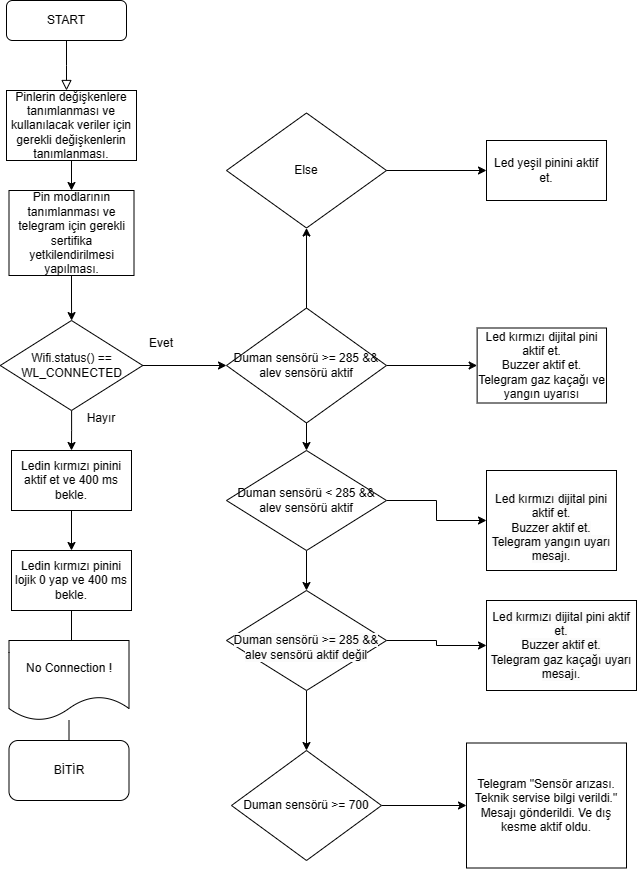

# Fire and natural gas leak alert project

## What we used?
- Esp8266 called as "Nodemcu" microprocessor.
- C language
- Telegrambot api for C. "UniversalTelegramBot.h"
- ESP8266 library for wireless connection as "ESP8266WiFi.h"

  

